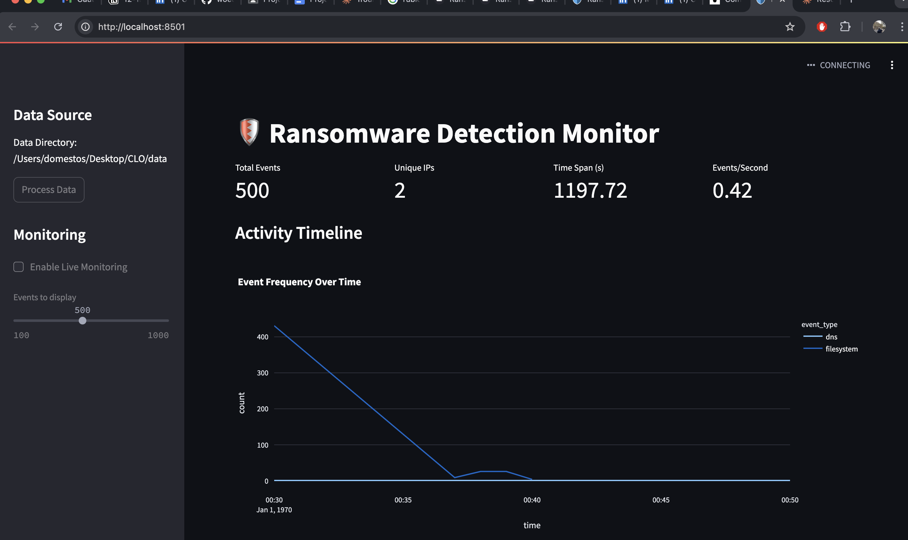

# Ransomware Detection and Analysis System



A comprehensive system for detecting and analyzing ransomware behavior using machine learning and real-time monitoring.

## Table of Contents

- [Problem Description](#problem-description)
- [Big Data and Cloud Need](#big-data-and-cloud-need)
- [Data Description](#data-description)
- [Application Description](#application-description)
- [Software Design](#software-design)
- [Usage](#usage)
- [Performance Evaluation](#performance-evaluation)
- [Advanced Features](#advanced-features)
- [Conclusions](#conclusions)
- [References](#references)

## Problem Description

The project tackles the critical challenge of real-time ransomware detection and analysis. With ransomware attacks becoming increasingly sophisticated and frequent, there's a pressing need for advanced detection systems that can:

- Process large volumes of system activity data
- Identify malicious patterns in real-time
- Prevent extensive damage before encryption begins
- Analyze behavior patterns across different ransomware families

## Big Data and Cloud Need

The system's requirements necessitate big data and cloud infrastructure:

- Individual log files can exceed several GB in size
- Real-time processing demands substantial computational resources
- Multiple data streams require simultaneous analysis
- ML model training needs significant processing power
- Historical data analysis requires scalable storage solutions

## Data Description

### Source

Data comes from IEEE DataPort's Open Repository for Ransomware Detection Tools. The dataset contains behavioral data from multiple ransomware families including:

- CTBLocker
- Cryxos
- DMALocker
- Aleta
- Virlock
- Locky
- GlobeImposter
- CryptFile2
- Crysis
- Cerber

### Data Types

- TCPconnInfo.txt: Network connection logs
- DNSinfo.txt: DNS query records
- IOops.txt: File system operations

### Format

- Structured text files with timestamp-based entries
- Multiple GB of log data across different ransomware families
- Data collection period: 2016-2018

## Application Description

### Platform

- Python-based application with Streamlit dashboard
- Real-time stream processing for log analysis
- Batch processing for historical data
- Machine learning for pattern detection

### Infrastructure

- Local/Cloud deployment options
- Scalable processing capabilities
- Memory-optimized data handling

## Software Design

### Architecture

- RansomwareLogProcessor: Core data processing engine
- RansomwareAnalyzer: Analysis and detection component
- RansomwareTrainer: ML model training module
- Streamlit Dashboard: Real-time visualization

### Dependencies

```
pandas==2.1.0
streamlit==1.28.0
scikit-learn==1.3.0
psutil==5.9.0
tqdm==4.65.0
plotly==5.17.0
```

## Usage

### Installation

```bash
# Clone repository
git clone [https://github.com/woe360/CloudData.git]
cd ransomware-detection

# Install dependencies
pip install -r requirements.txt
```

### Running the System

```bash
# Run the dashboard
streamlit run src/main.py

# Process specific log files
python src/data_processor.py --nat-dir data/NATscenario --original-dir data/originalScenario
```

## Performance Evaluation

### Processing Speeds

- DNSinfo.txt: ~150 files/second
- TCPconnInfo.txt: ~100 files/second
- IOops.txt: ~0.12 files/second (most resource-intensive)

### Optimizations

- Memory optimization through chunk processing
- Scalable based on available system resources
- Temporary file storage for large datasets

## Advanced Features

- Real-time memory monitoring and optimization
- Multi-encoding support for log files
- Incremental processing with temporary storage
- Adaptive chunk sizing based on system resources
- ML-based pattern detection for unknown ransomware variants

## Conclusions

### Achievements

- Successfully processes large volumes of ransomware behavioral data
- Real-time monitoring and visualization capabilities
- Memory-efficient processing of large log files

### Future Work

- Implementation of distributed processing
- Enhanced ML model training
- Integration with cloud-based storage
- Addition of more ransomware families
- Improved visualization and reporting

## References

1. IEEE DataPort. "Open Repository for Evaluation of Ransomware Detection Tools." https://ieee-dataport.org/open-access/open-repository-evaluation-ransomware-detection-tools
2. Streamlit Documentation. https://docs.streamlit.io/
3. scikit-learn Documentation. https://scikit-learn.org/
4. Python psutil Documentation. https://psutil.readthedocs.io/
